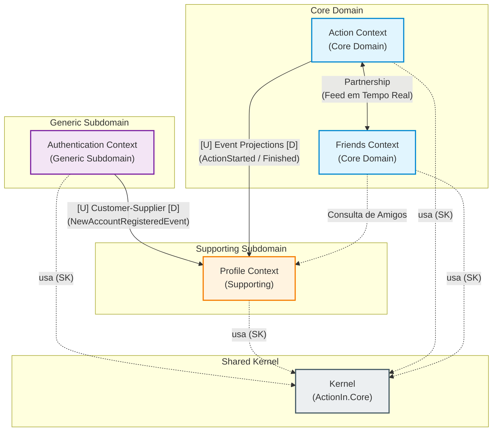

# Context Map — ActionIn

This document establishes the Context Map for ActionIn, formalizing the boundaries of each Bounded Context, their supplier/consumer roles, and the integration patterns addopten in.

---

## 1. Relationships between Bounded Contexts

### 1.1. Authentication (Upstream - U) $\rightarrow$ Profile (Downstream - D)
* **Relationship Pattern:** **Customer-Supplier (C/S) driven by Domain event**
* **Justification:**
  * The **Authentication** context is thw owner of the system's official identity. When an account is successfully created, it emits the `NewAccountRegisteredEvent`.
  * The **Profile** context acts as a consumer (Downstream), listening to the event to instantiate the user's profile projection (`UserProfile`) with their `UserId` e `Username`.
  * If the identity contract changes in the Upstream, the Downstream will need to adapt.

### 1.2. Action $\longleftrightarrow$ Friends
* **Relationship Pattern:** **Partnership**
* **Justificaion:**
  * There is a symmetric collaboration between both to meet the core value proposition of the social network (FR10 and FR11):
    * The **Friends** context maintains the friendship relations (`UserA` is friend with `UserB`).
    * The **Action** context orchestrates the state of actions (who is doing what in real-time).
    * To display the "what my friends are doing right now" feed, both modules cooperate. Neither dominates the ohter hierarchically; changes in integration constracts (such as `ActionStartedEvent` or friends query contracts) are mutually agreed upon between the two core domains.

### 1.3. Profile (Downstream - D) $\longleftarrow$ Action (Upstream - U)
* **Relationship pattern:** **Customer-Supplier / Event-Driven Projections**
* **Justification:**
  * The profile module projects the consolidated history of actions and the total time spent by the user (FR07, FR08).
  * The **Action** module emits lifecycle events (ActionStartedEvent, ActionFinishedEvent).
  * **Profile** consumes this information to keep its aggregated read data updated in a decoupled manner, without coupling the real-time transactional model to the static history.
### 1.4. All Conexts $\rightarrow$ Kernel (`ActionIn.Core`)
* **Relationship pattern:** **Shared Kernel (SK)**
* **Justification:**
  * All contexts (`Authentication`, `Profile`, `Action`, `Friends`) share infrastructure primatives and tactical patterns: `Entity`, `IAggregateRoot`, `DomainEvent`.
  * The Shared Kernel does not containt subdomain business rules, only cross-cutting abstractions.

---

## 2. Diagrama do Context Map (Mermaid)

